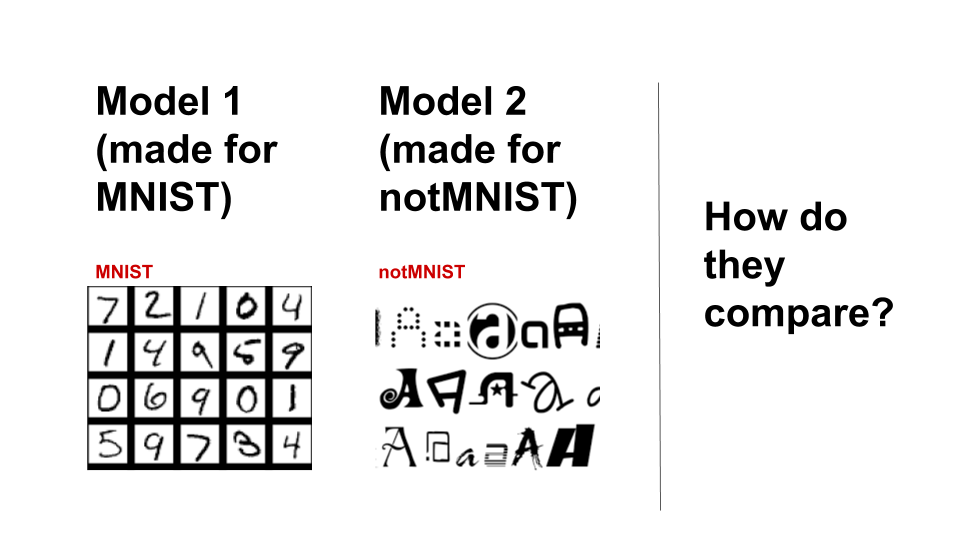
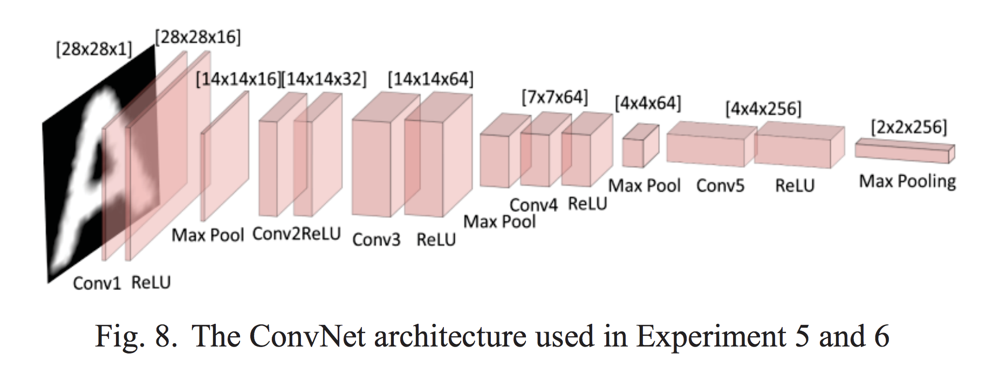
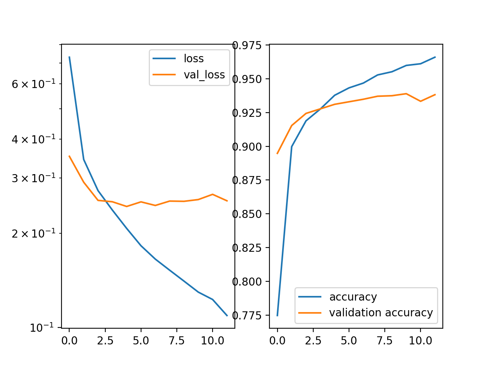
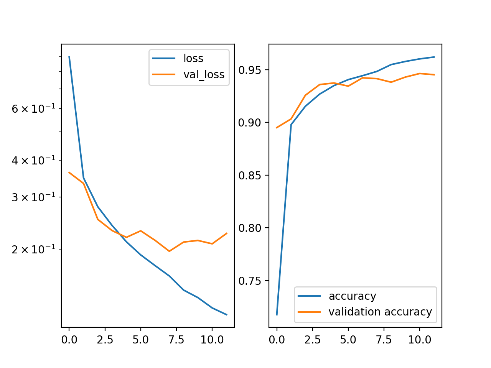
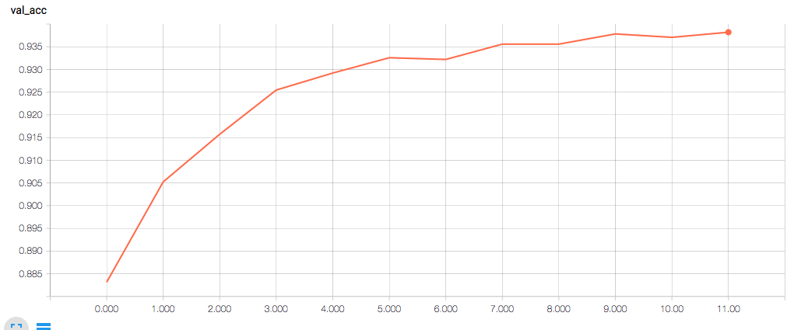
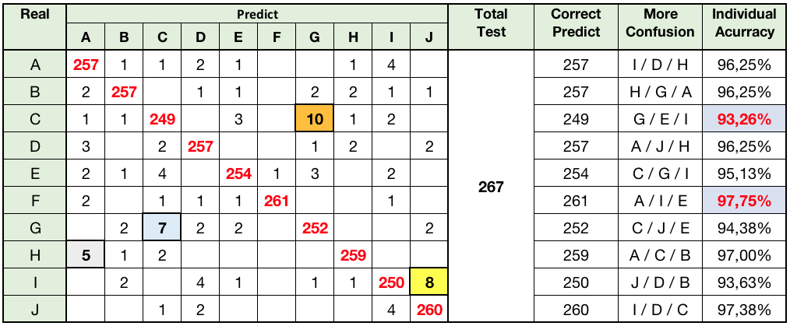
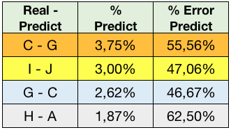
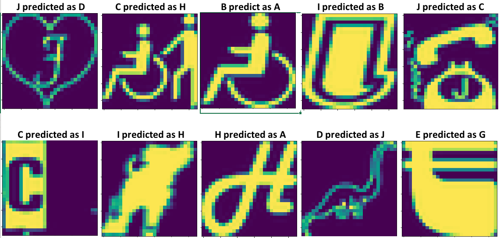

## Comparison of CNN for MNIST and notMNIST data

*by Nei Costa, Tyson Ward, and Christopher Winn*

*A comparision of two recurrent neural networks that are optimized for slightly different datasets (MNIST and notMNIST). Model 1 is optimized for MNIST, and model 2 is optimized for notMNIST. Both models are fit to both sets of data, and training times, accuracy, and errors are compared.*

___

#### About the data

* [MNIST](https://en.wikipedia.org/wiki/MNIST_database) - a large database of handwritten digits that is commonly used for training various image processing systems. We used Keras's builtin dataset with 70000 images representing digits 0-9.
* [notMNIST](http://yaroslavvb.blogspot.com/2011/09/notmnist-dataset.html) - developed in 2011 by Yaroslav Bulatov, this is a database of publicly available fonts and extracted glyphs. For our test we used a database of 18,724 images that represent the letters A-J.

#### Model 1 (optimized for MNIST)

*Keras "stock" recurrent neural network, fit for MNIST data. With MNIST the model can reach 99.16% accuracy in 12 epochs.  When applied to notMNIST data, was only able to achieve 93.8% accuracy in 12 epochs*

**Model 1 - Structure**

| Layer | Type | Filters / Nodes | Activation | Pooling | Dropout |
|-------|--------|---------|------------|---------|---------|
| 1     | Conv2D | 32      | relu       | -     | -    |
| 2     | Conv2D | 64      | relu       | 2x2    | 25%  |
| 3     | Dense | 128      | relu       | -     | 50%  |
| 4     | Dense | 10      | softmax       | -     | -  |

#### Model 2 (optimized for notMNIST)

*Adapted from paper by Bui/Chang*

Bui and Chang propose a model with 5 convolutional layers, and 2 fully-connected dense layers. When we ran their model "as is" our accuracy was 10% - obviously we had something wrong. The below represents our best model that started with Keras' stock model and slowly "stepped" toward Bui/Chang's model.

**Model 2 - Structure**

| Layer | Type | Filters / Nodes | Activation | Pooling | Dropout |
|-------|--------|---------|------------|---------|---------|
| 1     | Conv2D | 16      | relu       | 2x2     | -    |
| 2     | Conv2D | 32      | relu       | -    | -   |
| 3     | Conv2D | 64      | relu       | 2x2     | -   |
| 4     | Conv2D | 64      | relu       | 2x2     | 50%  |
| 5     | Dense  | 1024    | relu       | -   | 50%   |
| 6     | Dense  | 205   | elu       | -   | -   |
| 7     | Dense  | 10   | softmax      | -    | -    |

*L2 Regularization used at layers 5 and 6*

#### Approach

1. Fit model 1 (known to perform well on MNIST) to MNIST (acc=.9916)
2. Fit model 1 to notMNIST (acc=.938)
3. Write model 2 from notMNIST paper (acc=.1)
4. Began incrementing model 1 toward model 2, checking accuracy
5. Noted differences in best performing models
6. Fit model 2 to MNIST data (acc=.994)

#### Results

Accuracy Scores
|  | MNIST data | notMNIST data |
|-------|--------|---------|
| Model 1    | .992 | .938      |
| Model 2    | .994 | .955      |

Figure 1: Keras' stock MNIST model on nonMNIST

*As expected, the model developed for the MNIST dataset didn't perform as well with notMNIST data, only reaching an accuracy of .938.*

___

Figure 2: Model adapted from Bui/Chang paper.

*Model 2, adapted from Model 1 toward the Bui/Chang model, improved accuracy to .955.*

___

Figure 2b - Validation Accuracy by Epoch (from Tensorflow)

___

Figure 3 - Confusion Matrix of Model 2 on nonMNIST data

___

Figure 4 - Most Frequent Errors

___

Figure 5 - Errors we empathize with

___

#### Adaptations to perform on nonMNIST data

| Adaptation | Reason |
|-------|--------|
| Add Conv2D layer w/ 16 filters in front   | ? |
| Added 1 hidden dense layer    | ?  |
| Update Dense nodes to 1028 and 205   | ? |
| Added L2 regularization   | helps with overfitting |
| Change 2nd to last activation from 'relu' to 'elu'  | helps to push the mean activation of neurons closer to zero |
| Updated padding to 'same' from 'valid'  | convenient to keep track of design |

#### Learnings

* How to adapt an existing, working model to a new problem using others' research and by taking incremental steps
* Common patterns for recurrent neural networks:
  * Convolutional layers before dense layers
  * Convolution-Activation-Pool-Dropout
* How to plot a models progress after each epoch

#### Acknowledgments

* [Keras Team's CNN for MNIST dataset](https://github.com/keras-team/keras/blob/master/examples/mnist_cnn.py)
* Vy Bui, Lin-Ching Chang.  *"Deep Learning Architectures for Hard Character Classification"*. [paper](https://pdfs.semanticscholar.org/f3be/830ea5c1e0cb423434ec3dbb5414d49fc59e.pdf)
* [Yaroslav. Developer of notMNIST dataset.](http://yaroslavvb.blogspot.com/2011/09/notmnist-dataset.html)
* [Saikat Basak](http://saikatbasak.in/sigmoid-vs-relu-vs-elu/)
